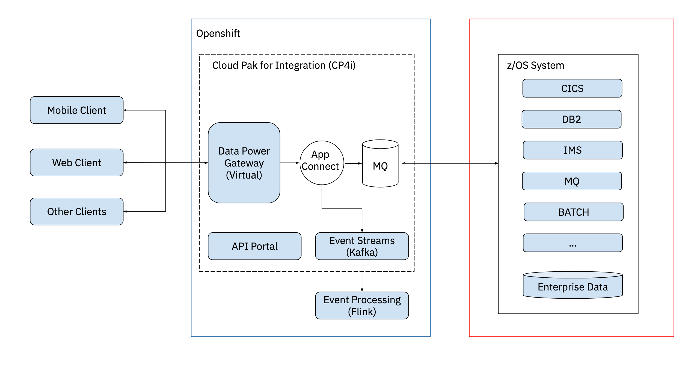
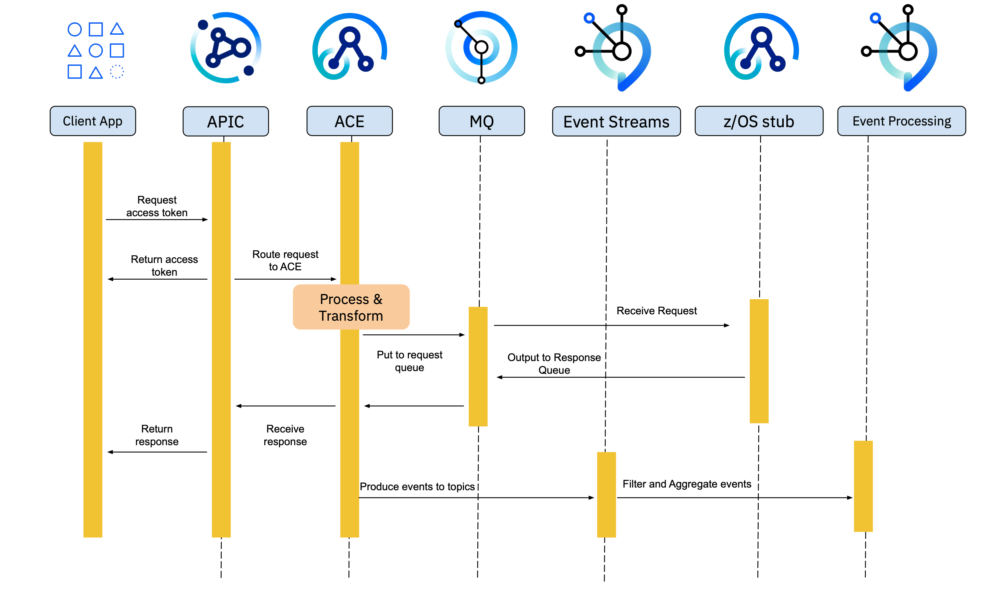
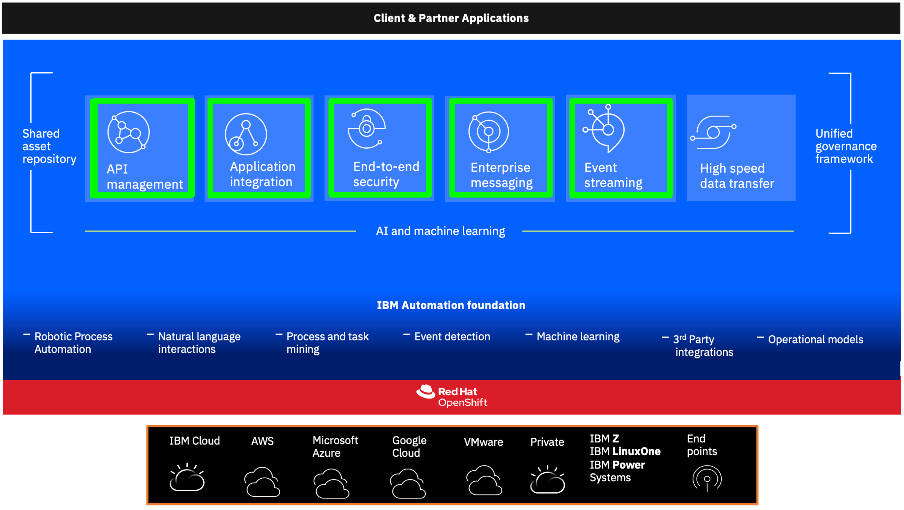

# Solution Architecture

### [Topic 3.1: High Level Architecture](README.md#high-level-architecture)
### [Topic 3.2: Detailed Solution Flow](README.md#detailed-solution-flow)
### [Topic 3.3: List of Software Products Used In Scenario2](README.md#list-of-software-products-used-in-scenario2)

#### [Topic 3.3.1: IBM App Connect Enterprise](README.md#ibm-app-connect-enterprise)
#### [Topic 3.3.2: IBM Event Streams](README.md#ibm-event-streams)
#### [Topic 3.3.3: IBM API Connect](README.md#ibm-api-connect)
#### [Topic 3.3.4: IBM Enterprise Messaging (MQ)](README.md#ibm-enterprise-messaging-mq)

## High Level Architecture

## Detailed Solution Flow

## List of Software Products Used In Scenario2

The Cloud Pak for Integration services deployed in this excerise are:

### IBM App Connect Enterprise

IBM Cloud Pak for Integration includes a market-leading application integration capability called App Connect Enterprise (ACE). It enables the implementation of API and event-driven integrations and provides extensive adaptation to on-premises and cloud-based applications. It provides tooling that is optimised to the users' skillsets, so that they can be productive in a matter of hours and achieve real results in days. 

Powerful underlying capabilities facilitate the implementation of even the most complex integration patterns. As a result, data can be moved quickly, accurately and robustly.

### IBM Event Streams

IBM Cloud Pak for Integration includes Event Streams, that helps to deliver more engaging customer experiences.

Built on open source Apache Kafka, IBM® Event Streams is an event-streaming platform that helps you build smart apps that can react to events as they happen. 

Event Streams is based on years of IBM operational expertise gained from running Apache Kafka event streams for enterprises. This makes Event Streams ideal for mission-critical workloads.

### IBM API Connect

IBM Cloud Pak for Integration includes API Connect as an integrated API management offering, where all of the steps in the API lifecycle, and the actions that surround it, are performed within the offering.

The steps of the API lifecycle include: 
- Create
- Run 
- Manage 
- Secure APIs

With API Connect, you can perform all of the lifecycle steps in a single integrated offering, removing the requirement to use multiple API management offerings to obtain the same capability.

### IBM Enterprise Messaging (MQ)

IBM Cloud Pak for Integration includes MQ, that can transport any type of data as messages, enabling businesses to build flexible, reusable architectures such as service-oriented architecture (SOA) environments. It works with a broad range of computing platforms, applications, web services and communications protocols for security-rich message delivery. 

IBM MQ provides a communications layer for visibility and control of the flow of messages and data inside and outside your organisation.

An application has a choice of programming interfaces, and programming languages to connect to IBM MQ.

IBM MQ is messaging and queuing middleware, with several modes of operation: 
- Point-to-point 
- Publish/Subscribe 
- File transfer

Applications can publish messages to many subscribers over multicast.

### IBM Event Processing

IBM Event Automation, Event Processing is a scalable, low-code, event stream processing platform that helps you transform and act on data in real time. Event Processing offers web-based authoring experience for gaining insights from the stream of event data available to your organisation.

Event Processing transforms event streaming data in real time, helping you turn events into insights. You can define flows that connect to event sources which bring event data (messages) from Apache Kafka into your flow, combined with processing actions you want to take on your events.

The flows are run as Apache Flink jobs. Apache Flink is a framework and a distributed processing engine for stateful computations over event streams. In addition to being the processing engine for Event Processing, Flink is also a standalone engine you can run custom Flink SQL workloads with.

Do note there exists auxiliary services that will run in conjunction with the services mentioned above. They will be 
explored in due time.

[Go back to -> Table of Contents](../README.md)

[Go to next topic -> Environment Setup](../Environment/README.md)