# IBM Cloud Pak for Integration - Configuration

[**6.1. High Level Architecture**](#_Toc105518919)

[**6.2. Messaging Queue (MQ)**](#_Toc105518924)

- [**6.2.1 Create Queue Manager**](#_Toc105518925)
- [**6.2.2 MQ Configuration**](#_Toc105518926)
- [**6.2.3 Configure Default Channel Security**](#_Toc105518927)

[**6.3. Event Streams **](#_Toc105518950)
- [**6.3.1 Create Event Streams Instance**](#_Toc105518951)


[**6.4. Prepare Client Tools**](#_Toc105518920)

- [**6.4.1 IBM App Connect Enterprise (ACE) Toolkit Setup**](#_Toc105518921)
- [**6.4.2 Openshift Command Line Interface (CLI) Setup**](#_Toc105518922)
- [**6.4.3 Mailtrap SMTP Setup**](#_Toc105518923)


[**6.4. Integration - App Connect Enterprise**](#_Toc105518928)

- [**6.4.1 Integration - ACE Prerequisites**](#_Toc105517032)
- [**6.4.2 Integration - ACE Development & Deployment**](#_Toc105518929)
- [**6.4.3 Integration - ACE Configurations**](#_Toc105554367)
- [**6.4.4 Integration - ACE Runtimes**](#_Toc105554345)


[**6.6. API Connect (APIC)**](#api-connect-apic)

- [**6.6.1 Cloud Manager (API Management Administration)**](#api-connect-apic)
  - [Create Organization](#create-organization)
  - [Configure SMTP for notifications](#configure-smtp-for-notifications)
  - [Configure admin email id](#configure-admin-email-id)
- [**6.6.2 API Manager (API Management)**](#api-manager-api-management)
  - [Develop API](#develop-api)
  - [Configure API](#configure-api)
  - [Develop Product](#develop-product)
  - [Create Catalog](#create-catalog)
  - [Publish Product](#publish-product)
  - [API Connect Developer Portal](#api-connect-developer-portal)

[**6.7. Event Streams**](#_Toc105518935)


[**6.8. Event Processing**](#_Toc105518945)


### ------------------------------------------------------------------ ###

<span id="_Toc105518919" class="anchor"></span>**High Level
Architecture**

Below is the high level architecture that we plan to implement as part
of this scenario.


<span id="_Toc105518920" class="anchor"></span>**Prepare Client Tools**

<span id="_Toc105518921" class="anchor"></span>**IBM App Connect
Enterprise (ACE) Toolkit Setup**

Install IBM App Connect Enterprise for developers (also called ACE).
Make sure to select the correct download package for your OS (Windows,
Linux, Mac).

Click on **Download** button on the following
link: [<u>https://www.ibm.com/docs/en/app-connect/12.0?topic=enterprise-download-ace-developer-edition-get-started</u>](https://www.ibm.com/docs/en/app-connect/12.0?topic=enterprise-download-ace-developer-edition-get-started)


The version used in this practicum is 12.0.4

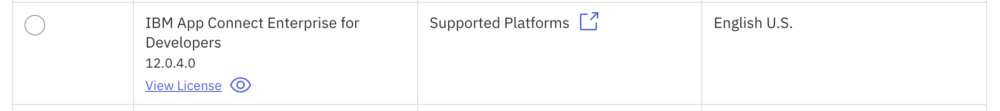

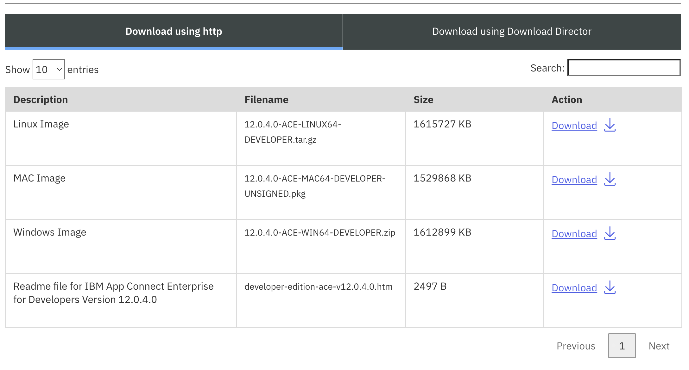

Complete the installation through the installer package you just
downloaded for your OS. eg: 12.0.4.0-ACE-MAC64-DEVELOPER-UNSIGNED. You
can use the IBM ACE Installation page as a guide to complete the
installation.

Once installed, open the installed ACE toolkit. A view similar to the
screenshot below will launch.


<span id="_Toc105518922" class="anchor"></span>**Openshift Command Line Interface (CLI) Setup**

Download Openshift Command line tools (OC Client)


Download OC Client for your platform


Place downloaded oc binary file (oc or oc.exe )to the path in variable for your platform. See the below URL for more details.

https://docs.openshift.com/container-platform/4.8/cli_reference/openshift_cli/getting-started-cli.html 

<span id="_Toc105518923" class="anchor"></span>**Mailtrap SMTP Setup**

Signup for a SMTP account on mailtrap.io. Once logged in, note down your
SMTP connection settings. For Example,

Host: smtp.mailtrap.io

Port: 2525

User: 2ef08bdc18285b

Password: 11xxxxxx06b8da


You can also check all your emails under MyInbox in mailtrap web site.


<span id="_Toc105518924" class="anchor"></span>**Messaging Queue (MQ)**

<span id="_Toc105518925" class="anchor"></span>**Create Queue Manager**

For starters, run the following scripts:

```commandline
./MQ/utils/mqsc.sh
./MQ/operands/mq.sh
```

It will take a few minutes to deploy the Queue Manager initially. You should see a new entry
in the Platform Navigator UI pertaining to the MQ deployment.

Do note the initial deployment of each capability, typically takes a few minutes to deploy. Operator/operand images 
are cached within the worker node following an initial successful deployment. As such, subsequent deployments are 
dramatically shortened.


Once the status is READY, click on the MQ link and accept the self-signed certificate. You should be redirected
to the MQ UI with the following initial view:


Click on the "Manage messagingserver" tile. You should be presented with the following view:


Click on the Queues tab and confirm the following queues are displayed:


<span id="_Toc105518926" class="anchor"></span>**MQ Configuration**

You may be wondering where these queues were configured. Let us inspect the contents of the following file:

```commandline
MQ/utils/mqsc.sh
```

```commandline
#!/bin/bash


deploy_mqsc() {

  cat <<EOF | oc create -n integration-enablement -f -
  kind: ConfigMap
  apiVersion: v1
  metadata:
    name: enablement-mqsc
  data:
    mq.mqsc: |-
      DEFINE CHANNEL('DIGITAL') CHLTYPE(SVRCONN) TRPTYPE(TCP) SSLCAUTH (OPTIONAL) REPLACE
      ALTER AUTHINFO(SYSTEM.DEFAULT.AUTHINFO.IDPWOS) AUTHTYPE(IDPWOS) CHCKCLNT(OPTIONAL)
      ALTER QMGR CHLAUTH(DISABLED)
      REFRESH SECURITY TYPE(CONNAUTH)
      DEFINE QLOCAL('TRANSFER.REQUEST.QUEUE') DEFPRESP(SYNC) DEFPSIST(YES)
      DEFINE QLOCAL('TRANSFER.RESPONSE.QUEUE') DEFPRESP(SYNC) DEFPSIST(YES)
      DEFINE QLOCAL('BALANCE.REQUEST.QUEUE') DEFPRESP(SYNC) DEFPSIST(YES)
      DEFINE QLOCAL('BALANCE.RESPONSE.QUEUE') DEFPRESP(SYNC) DEFPSIST(YES)
      DEFINE QLOCAL('DEBIT.REQUEST.QUEUE') DEFPRESP(SYNC) DEFPSIST(YES)
      DEFINE QLOCAL('DEBIT.RESPONSE.QUEUE') DEFPRESP(SYNC) DEFPSIST(YES)
EOF
}

deploy_mqsc
```

This is nothing but a configmap referenced by the Queue Manager (as seen shortly) containing a number of 
MQ commands configured to run at application startup. Think of them as Constructors for a given Class. 
The "DEFINE QLOCAL" commands created the queues.

The first line defines a channel. A channel is an interface residing over a queue or set of queues where security, audit
and monitoring policies can be applied for clients attempting the queues over the channel.

Note we have effectively disabled security for this exercise, as given by the third line. It goes without saying, these 
configurations should be limited to learning/development use-cases.

Next, let us inspect the contents of the Queue Manager itself found here:

```commandline
MQ/operands/mq.sh
```

```commandline
apiVersion: mq.ibm.com/v1beta1
kind: QueueManager
metadata:
  name: messaging-server
  annotations:
    com.ibm.mq/write-defaults-spec: 'false'
  namespace: integration-enablement
spec:
  template:
    pod:
      containers:
        - name: qmgr
          env:
          - name: MQSNOAUT
            value: "yes"
  license:
    accept: true
    license: L-BMSF-5YDSLR
    use: Production
  web:
    console:
      authentication:
        provider: integration-keycloak
      authorization:
        provider: integration-keycloak
    enabled: true
  queueManager:
    mqsc:
      - configMap:
          items:
            - mq.mqsc
          name: enablement-mqsc
    availability:
      type: SingleInstance
    storage:
      queueManager:
        type: persistent-claim
      defaultClass: ocs-storagecluster-ceph-rbd
  version: 9.4.0.0-r3
```

Note the following:

1) spec.queueManager.mqsc references the aforementioned mqsc configmap discussed above
2) Message persistence is enabled by referencing a valid RWO block based storage class in spec.queueManager.storage
3) We define a Single Instance, as opposed to a HA instance, in spec.queueManager.availability
4) Finally, we delegate console based authentication and authorisation to Keycloak as defined in spec.web.console

The next section concerns itself with Event Streams.

<span id="_Toc105518950" class="anchor"></span>**Event Streams**

<span id="_Toc105518951" class="anchor"></span>**Create Event Streams Instance**

Execute the following script for starters:

```commandline
./EventAutomation/EventStreams/deploy-es.sh
```

This should register an instance of Event Streams in the Platform Navigator, as shown below:


The status field will ultimately display a "Warning" value. This is expected. This Kafka deployment is a non production
deployment from a configuration perspective. Click the Event Streams link. You will be presented with a view as below:


Click on the "Topics" tab on the left hand side and create a topic called "TRANSFER_REQUESTS" as shown below:


The default values assigned to the remaining configurations are sufficient. You should be presented with the following
view once the topic is created:


<span id="_Toc105518928" class="anchor"></span>**App Connect Enterprise**

Run the following command below, do note the current working directory of "Configuration" is assumed:

```commandline
./ACE/operands/ui/deploy-user-interfaces.sh 
```
This script simply creates the objects specified in the yaml files. That is, an ACE "Dashboard" and a "Designer". 
The Dashboard is effectively a one stop shop providing the means for an authorised user to manage all running ACE instances within 
your OpenShift cluster. The Designer, on the other hand, allows one to deploy applications in a low code/no code manner.
Day 5, the final day, primarily concerns itself with the Designer.

Navigate to the platform navigator instance. You will now see two new entries corresponding to the aforementioned 
Dashboard and Designer instances with names "enablement-dashboard" and "enablement-authoring" respectively.

Refer to the image below:


Depending on the time difference between running the script above and navigating to the platform navigator, the 
instances above may either be in the ready or pending state.

Do note the Integration Dashboard will always register a warning sign. This is because we deployed this service without
a storage class enabled for persistence. For testing/development/learning scenarios, this is not an issue.

<span id="_Toc105517032" class="anchor"></span>**Integration - ACE Prerequisites**

Prior to developing and indeed deploying the ACE powered banking application backend, the "persistent" layers of the app
ought to be deployed. They are:

1) A PostgreSQL (PGSQL) Database
2) Cloud Object Storage
3) A service which simplifies the means of pushing deployment artefacts to Cloud Object Storage

The Database holds customer and transaction related information for the customers of our fictitious bank. Cloud Object 
storage will host the artefacts produced once flow development is complete. 

Do note the storage is not restricted to COS. Virtually any HTTP(S) repository is supported, such as Nexus or JFrog Artifactory.

In this exercise however, cloud object storage will be used. A bucket has already been created and 
configured for consumption. As such, this section concerns itself with points 1 and 3 above.

#### PGSQL

Do note in the commands to follow, the current working directory of "Configuration" is assumed.

Run the script given below:

```commandline
./ACE/prerequisites/pgsql/deploy-persistence-layers.sh
```

This script executes a number of functions behind the scenes. Let us examine them in more detail. 
Find below the functions invoked as a result of calling the script above: 

```commandline
deploy_pgsql_subscription
wait_healthy_sub
deploy_db
wait_healthy_cluster
populate_db
```

The pgsql operator and corresponding operand are deployed as given in the first and third lines respectively.
Once the DB is ready, as given by the fourth line, the "populate_db" function is invoked, which as the name implies, 
seeds the database with fictitious users by creating and populating two distinct tables. Specific details on said tables can be
found in the following directory:

```commandline
ACE/prerequisites/pgsql/app/main.py
```

Find below the relevant contents of the script.

```commandline
    init_table_commands = (
        """
        CREATE TABLE TRANSFERS (
            TRANSFER_ID SERIAL PRIMARY KEY,
            FROM_ID SERIAL NOT NULL,
            TO_ID SERIAL NOT NULL,
            TRANSFER_AMOUNT INTEGER NOT NULL,
            TRANSFER_DATE VARCHAR(256)
        )
        """,
        """ 
        CREATE TABLE CUSTOMERS (
                CUSTOMER_ID SERIAL PRIMARY KEY,
                FIRST_NAME VARCHAR(255),
                LAST_NAME VARCHAR(255),
                FULL_NAME VARCHAR(255),
                BALANCE INTEGER NOT NULL
        )
        """,
        """
        INSERT INTO 
        CUSTOMERS(CUSTOMER_ID, FIRST_NAME, LAST_NAME, FULL_NAME, BALANCE) VALUES
          (001, 'Malicious', 'User', 'Malicious User', 100), 
          (123, 'Marwan', 'Attar', 'Marwan Attar', 100000),
          (456, 'Oliver', 'Medland', 'Oliver Medland', 200000),
          (789, 'Peter', 'Jessup', 'Peter Jessup', 500000),
          (234, 'Leonardo', 'Vidal', 'Leonardo Vidal', 8900000),
          (567, 'Sasha', 'Khalikov', 'Sasha Khalikov', 9003321),
          (890, 'Bernd', 'Beilke', 'Bernd Beilke', 5000021),
          (100, 'Mohak', 'Talreja', 'Mohak Talreja', 3455021);   
        """
    )

    for command in init_table_commands:
        cursor.execute(command)
    cursor.close()
    connection.commit()
```
The "populate_db" function is nothing more than a Kubernetes Job which performs the above commands once a secure
connection to the Database is established.

Next, we deploy the cloud object storage client. Relevant artefacts can be found in the following directory:

```commandline
ACE/prerequisites/icos
```

Run the following command:

```commandline
./ACE/prerequisites/icos/deploy-icos-client.sh
```

The cloud object storage client is described by the pod specification. The pod simply watches for the presence of new
files found in the /tmp directory of the pod. The newly added file(s) are subsequently pushed to the bucket in question.

A FileSystem Event Handler watches for the presence of added/modified files in the /tmp directory, and performs a 
multipart upload in such case:

```commandline
class FSEventHandler(FileSystemEventHandler):

    # See README

    def on_created(self, event: FileCreatedEvent) -> None:
        head_tail = os.path.split(event.src_path)
        file_name = head_tail[1]
        multi_part_upload(bucket_name=os.getenv("COS_BUCKET"),
                          item_name=file_name,
                          file_path=event.src_path
                          )

    def on_modified(self, event: FileModifiedEvent) -> None:
        head_tail = os.path.split(event.src_path)
        file_name = head_tail[1]
        if not os.path.isdir(event.src_path):
            multi_part_upload(bucket_name=os.getenv("COS_BUCKET"),
                              item_name=file_name,
                              file_path=event.src_path
                              )
```


We now test the pod (client), to verify it is indeed performing uploads as one would expect:

```commandline
./ACE/prerequisites/icos/validate-icos-client.sh
```

The script performs the following:

```commandline
verify_icos_client() {

  read -p 'Please enter your name: ' name
  echo "$name TEST ICOS" > $name.txt
  echo "Uploading file to ICOS client..."
  oc cp $name.txt -n integration-enablement icos-client:/tmp
  echo "Upload complete. Removing file..."
  rm $name.txt
  echo "Wait for upload complete.."
  sleep 5
  echo "Performing download..."
  curl https://sydney-cos.s3.au-syd.cloud-object-storage.appdomain.cloud/$name.txt --output $name.txt
}

```

Perform a file listing:

```commandline
ls
```

The script removes the local file once the upload is complete. If the file is present in your local directory, this must
imply the download was successful. If the download is successful, this must imply the upload operation ran successfully.
This implies the icos client is indeed functional. Verify the contents of the file contains your name followed by 
the string "TEST ICOS"

Do note authorisation was performed on uploads, but not downloads.

Feel free to delete the downloaded .txt file now. Do note the command below deletes all txt files. Update the command 
below in the event you had txt files you wish to retain.

```commandline
rm *.txt
```

<span id="_Toc105518929" class="anchor"></span>**Integration - ACE Development & Deployment**

The end to end procedure resembles that of an application programmer developing code for any given app.

On a high level, the procedure is as such:

1) Develop Flow(s)
2) Test Flow(s)
3) Build Flow(s)
4) Deploy Flow(s)

Any piece of code ought to be tested extensively prior to deployment. In this exercise, we shall omit the
testing component and focus solely on steps 1, 3 and 4 above.

#### Develop Flow

The detailed solution is given below:


On a high level, the following occurs:

1) A user would navigate to the digital banking application (as seen shortly), authenticates himself/herself, specifies an amount to transfer to a given user and authorises the transaction.
2) This transfer request is effectively handled by an ACE application, and specifically message flows configured to handle requests originating from the fronting client. A message flow parses the request and performs relevant writes to the underlying database.
3) The status of the transfer is then pushed to a separate queue found in IBM MQ.
4) Another message flow reads from said queue and pushes the details within to a Kafka topic.

Each "transaction" above is effectively handled by a given message flow. The details of said flows are dealt with in the following subsections.

Prior to proceeding please do note the ACE/utils directory contains the application and message flows should you require it after this exercise.

Take note during flow development, changes applied are not automatically saved. Ensure you periodically hit "Command/Control S" when developing below.

##### Develop Flow - Transfer Handler

As stated earlier, this flow will execute the following:

1) Parse HTTP input from the sender where said input contains the transfer specifications, as requested by the user.
2) Write to the underlying database, removing X amount from the sender's balance and adding the same amount to the receiver's balance.
3) Write the status of the database interaction (transfer transaction) to a specific messaging queue.
4) Notifies the sender of the transaction status (as in, success or fail).

App Connect Enterprise contains native plugins to enable integration developers to perform routine tasks. This includes:

1) HTTP Nodes
2) Kafka Nodes
3) MQ Nodes
4) And so on and so forth...

The flow in question is given below.


There is a palette containing plugins (connectors) to various different common services, such as those mentioned above.


Search for the word "HTTP" within the textbox found in the Palette. Drag and drop the node titled "HTTP Input" anywhere in the canvas.

When you click on the node, you are presented with various configuration options. This includes configuring the endpoint, serialising various message formats, validations to be performed on said message bodies and so on and so forth. We will focus on a few such configurations.

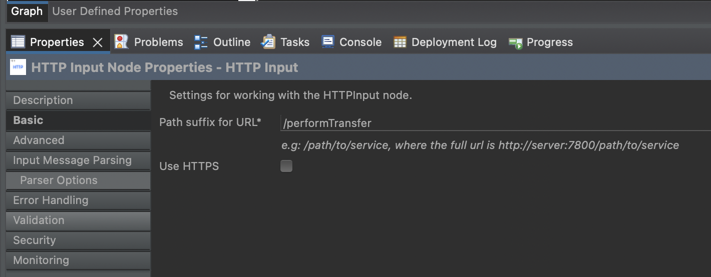

Navigate to the "Basic" tab and modify the path suffix to "/performTransfer" as seen in the image above.

Next, navigate to the "Input Message Parsing" tab and ensure the "Message Domain" is set to JSON as seen below.


Next, search for the "HTTP Header" node. Drag and drop that into the canvas, and connect the "Out" Terminal of HTTP Input to the "In" terminal of the aforementioned "HTTP Header" node.


Ensure the "Delete Header" option is toggled on in the HTTPInput tab as shown below.


Next, search for the "Compute" node in the palette. Drag and drop said node into the canvas, and connect the "Out" terminal of the previous node to the one and only "In" terminal of the compute node.

In the basic section of the the configuration, ensure the Data Source configuration is set to the following value: ``` POSTGRESQL ```

Please ensure this is entered verbatim. Effectively, this defines the Database we wish to connect to. Database configuration is handled elsewhere and will be covered off in due time.

Next, double click on the (Compute) node itself. You will be presented with an editor and sample code. Overwrite this in favour of the code snippet given below:

```commandline
CREATE COMPUTE MODULE DatabaseCompute_Compute
        CREATE FUNCTION Main() RETURNS BOOLEAN
        BEGIN
                SET OutputRoot = InputRoot;
                DECLARE Input REFERENCE TO InputRoot.JSON.Data;
                DECLARE DBSchema CHARACTER 'public';
                DECLARE DBTRTable CHARACTER 'transfers';
                DECLARE DBCUTable CHARACTER 'customers';
                INSERT INTO Database.{DBSchema}.{DBTRTable} (transfer_id, from_id, to_id, transfer_amount, transfer_date)
                            Values( Input.transfer_id, Input.from_id, Input.to_id, Input.transfer_amount, Input.transfer_date);
                UPDATE Database.{DBSchema}.{DBCUTable} as CU
                  SET balance = CU.balance + Input.transfer_amount
                  WHERE CU.customer_id = Input.to_id;
                UPDATE Database.{DBSchema}.{DBCUTable} as CU
                  SET BALANCE = CU.BALANCE - Input.transfer_amount
                  WHERE CU.customer_id = Input.from_id;
                IF (SQLCODE = 0) THEN
            SET OutputRoot.JSON.Data.Status = 'SUCCESS';
        ELSE
            SET OutputRoot.JSON.Data.Result =  'FAIL';
        END IF;
                RETURN TRUE;
        END;
END MODULE;

```
It is relatively easy to see what the piece of code is attempting to do:

1) Add a row to the "transfers" table of the database signifying the sender's intent to perform a transfer
2) Subtract X amount from the balance field of the sender in the "customers" table.
3) Add X amount to the balance field of the target recipient in the "customers" table.

This is written in ESQL (Extended SQL). In a nutshell, Extended Structured Query Language (ESQL) is a programming language defined by IBM® App Connect Enterprise (formerly Integration Bus) to define and manipulate data within a message flow.

There exists a JavaComputeNode, allowing one to write Java code to perform the above instead.

Search for "MQ Output" in the Canvas. Drag and drop said node and connect the "Out" terminal of the Compute node to the "In" terminal of the MQ Output Node.

In the "Basic" section of the configuration, ensure the value of "TRANSFER.REQUEST.QUEUE" is associated with the "Queue Name" field as given below.


In the "MQ Connection" section, ensure the following are set:

1) Connection: MQ client connection properties
2) Destination queue manager name: messagingserver
3) Queue Manager host name: messaging-server-ibm-mq.integration-enablement.svc.cluster.local
4) Listener port number: 1414
5) Channel name: DIGITAL

They are configured as shown below.


Finally, drag and drop the "HTTP Reply" node into the canvas. Connect the "Out" terminal of the MQOutput Node to the "In" terminal of the HTTP Reply node. The default configurations assigned to the HTTP Reply node should suffice for this exercise.

Congratulations! You have developed your own message flow. There remains another two message flows, as discussed in the following sections. Fortunately, they are much less involved.


##### Develop Flow - Kafka Handler

This flow simply reads from the queue in question and outputs the contents of each message within said queue to a specified topic in Kafka.


An "MQ Input" node, as opposed to an "MQ Output" node, is used this time.

The configurations applied for the MQ Output node in the previous section apply here. For the "MQ connection" tab, they are:

1) Connection: MQ client connection properties
2) Destination queue manager name: messagingserver
3) Queue Manager host name: messaging-server-ibm-mq.integration-enablement.svc.cluster.local
4) Listener port number: 1414
5) Channel name: DIGITAL

Finally, ensure the value of "TRANSFER.REQUEST.QUEUE" is associated with the "Queue Name" field in the basic stanza.


Next, search for "KafkaProducer" node in the palette. Drag and drop this node and connect the "Out" terminal of the "MQ Input" node to the aforementioned "KafkaProducer" node.

Navigate to the "Basic" configuration and ensure the following configurations are set:

1) Topic name: TRANSFER_REQUESTS
2) Bootstrap servers: es-enablement-kafka-bootstrap.integration-enablement.svc.cluster.local:9092
3) Client ID: 101 (You may set this to any integer of your choosing)
4) Add server name suffix to client id: True
5) Acks: 0
6) Timeout: 60

Navigate to the Security tab and ensure the following configurations are met:

1) Security protocol: PLAINTEXT
2) SSL Protocol: TLSv1.2


There remains one more flow. This flow returns the customer details which is cached by the frontend application, as discussed in the following section.


##### Develop Flow - Customer Details Handler

The flow is given below.


Select an "HTTP Input" node from the palette and drop that in the canvas. Ensure the "Path suffix for URL" field is set to a value of "/getDetails".


Next, drag a "Compute" node from the palette and connect the "Out" terminal of the HTTP Input node to the "In" terminal of the aforementioned Compute node.

Ensure the "Data source" field found in the "Basic" tab of the compute node is set to a value of "POSTGRESQL".

Double click on the node, and overwrite the existing code with the code snippet given below:

```commandline
CREATE COMPUTE MODULE GetCustomerDetails_Compute
        CREATE FUNCTION Main() RETURNS BOOLEAN
        BEGIN
                SET OutputRoot = InputRoot;
                DECLARE Input REFERENCE TO InputRoot.JSON.Data;
                DECLARE DBSchema CHARACTER 'public';
                DECLARE DBTable CHARACTER 'customers';
                DELETE FIELD OutputRoot.*[<];
                SET OutputRoot.XML.Data.Customers[] =
                        (SELECT T.customer_id, T.first_name, T.last_name, T.full_name FROM Database.{DBSchema}.{DBTable} AS T);
                IF (SQLCODE = 0) THEN
            SET OutputRoot.XML.Data.Status = 'SUCCESS';
        ELSE
            SET OutputRoot.XML.Data.Result =  'FAIL';
        END IF;
                RETURN TRUE;
        END;
END MODULE;

```
Select contents (columns) of the "customers" table is returned in XML format (specifically, a list of XMLs) back to the calling application. The "balance" field, for obvious purposes, was excluded in the response.

For completeness, the response is as such:

```commandline
<?xml version="1.0"?>
<Data>
  <Customers>
    <customer_id>1</customer_id>
    <first_name>Malicious</first_name>
    <last_name>User</last_name>
    <full_name>Malicious User</full_name>
  </Customers>
  <Customers>
    <customer_id>789</customer_id>
    <first_name>Peter</first_name>
    <last_name>Jessup</last_name>
    <full_name>Peter Jessup</full_name>
  </Customers>
  <Customers>
    <customer_id>234</customer_id>
    <first_name>Leonardo</first_name>
    <last_name>Vidal</last_name>
    <full_name>Leonardo Vidal</full_name>
  </Customers>
  <Customers>
    <customer_id>567</customer_id>
    <first_name>Sasha</first_name>
    <last_name>Khalikov</last_name>
    <full_name>Sasha Khalikov</full_name>
  </Customers>
  <Customers>
    <customer_id>890</customer_id>
    <first_name>Bernd</first_name>
    <last_name>Beilke</last_name>
    <full_name>Bernd Beilke</full_name>
     </Customers>
  <Customers>
    <customer_id>100</customer_id>
    <first_name>Mohak</first_name>
    <last_name>Talreja</last_name>
    <full_name>Mohak Talreja</full_name>
  </Customers>
  <Customers>
    <customer_id>123</customer_id>
    <first_name>Marwan</first_name>
    <last_name>Attar</last_name>
    <full_name>Marwan Attar</full_name>
  </Customers>
  <Customers>
    <customer_id>456</customer_id>
    <first_name>Oliver</first_name>
    <last_name>Medland</last_name>
    <full_name>Oliver Medland</full_name>
  </Customers>
  <Status>SUCCESS</Status>
</Data>
```

Again, Java code could have been written using a "JavaCompute" node instead of a "Compute" node.


Next, drag and drop an "HTTP Reply" node from the Palette and connect the "Out" Terminal of the Compute Node.
The default configurations should suffice for this exercise.

Congratulations! You have successfully developed the backend application for our newly modernised digital bank!


#### Build Flow

We now build the resulting artefact, encompassing the developed message flows and ESQL modules. The resulting artefact are files of type "BAR". Think of BAR files as the Java equivalent of JAR files.

Right click anywhere within the "Application Development" section on the left hand side of the screen and select "new -> BAR file".


Input a name of your choosing below.


Select the application containing your message flows (tick in the image below) and click "Build and Save" found on the top right hand corner of the image below.


Scroll down within the "Application Development section" found on the right hand side until you stumble upon the 
"Independent Resources" section. A nested directory titled "BARfiles" can be found within. The BAR file you just built
can be found there. You may copy and paste (command/control C, command/control V) this BAR file into a location of your
choosing.

For what it is worth, building the application (generating the resultant BAR file) can be done programmatically,
typically employed in CI/CD flows.

#### Deploy Flow

The final section concerns itself with deployment. As stated earlier, any artefacts produced during development should be subject to extensive testing prior to deployment. We forgo testing in this exercise and deploy the BAR file to its intended location.

There exists a couple of methods to deploy the BAR file:

1) "Bake" the BAR file within the container image itself, and deploy said container.
2) Push the BAR file to an HTTP(S) repository, and have the ACE base container image fetch the bar file remotely during application startup.

We will perform the latter in this exercise. The HTTP(S) repository is our cloud object storage bucket deployed in IBM 
Cloud.

Let us push the BAR file to COS storage using our intermediary client deployed in the previous section:

```commandline
oc cp /path/to/barfile.bar -n integration-enablement icos-client:/tmp
```

Please change /path/to/barfile.bar in accordance with your local environment. We've effectively "speed ran" our way 
through a typical CI/CD flow.

<span id="_Toc105554367" class="anchor"></span>**Integration - ACE Configurations**

This section concerns itself with creating ACE specific configuration objects. These objects are injected into the pod 
during startup time allowing your deployed ACE workflow to interact with upstream/downstream systems in a secure manner.

Run the following commands:

```commandline
./ACE/operands/configurations/1-create-barauth-configuration.sh
./ACE/operands/configurations/2-create-db-configuration.sh
./ACE/operands/configurations/3-create-odbc-configuration.sh
```

Inspect the contents of the following file:

```commandline
ACE/operands/configurations/odbc.ini
```

```commandline
[ODBC Data Sources]
POSTGRESQL=DataDirect ODBC PostgreSQL Wire Protocol

[POSTGRESQL]
DRIVER=/opt/ibm/ace-12/server/ODBC/drivers/lib/UKpsql95.so
Description=DataDirect ODBC PostgreSQL Wire Protocol
Database=app
HostName=enablement-persistence-rw.integration-enablement.svc.cluster.local
PortNumber=5432

[ODBC]
InstallDir=/opt/ibm/ace-12/server/ODBC/drivers
UseCursorLib=0
IANAAppCodePage=4
UNICODE=UTF-8
```

Do note the second stanza. That is, the one titled "POSTGRESQL". This contains, amongst other data points, the hostname 
and port of the database. This data source was directly referenced by the Compute (ESQL) nodes during ACE development.

An ACE "configuration" object/operand is fashioned around this such that the compute nodes with all message flows within
ACE now map the "POSTGRESQL" data source configuration to the IP:PORT pair as described above. The relevant configuration
object can be found in the here:

```commandline
ACE/operands/configurations/3-create-odbc-configuration.sh
```

Do note the configuration object is of type "ODBC" as given below:

```commandline
create_config() {

  config=`cat odbc.ini | base64`
  cat <<EOF | oc create -n integration-enablement -f -
  apiVersion: appconnect.ibm.com/v1beta1
  kind: Configuration
  metadata:
    labels:
      backup.appconnect.ibm.com/component: configuration
      bcdr-candidate: t
      component-name: appconnect
    name: odbcini 
  spec:
    description: ODBC INI configuration to access PSQL 
    contents: $config
    type: odbc
    version: 12.0.12-r3
EOF

}
```

What about authentication to the Database? This is effectively handled by the following script:

```commandline
ACE/operands/configurations/2-create-db-configuration.sh
```

Pay attention to lines 6 and 7 within:

```commandline
local username=`oc get secret enablement-persistence-app -n integration-enablement -o json | jq '.data.username' |  tr -d '"' | base64 -d`
local password=`oc get secret enablement-persistence-app -n integration-enablement -o json | jq '.data.password' |  tr -d '"' | base64 -d`
```

The username and password for the DB deployment (as deployed earlier) are extracted and embedded into the following ACE
Configuration object below:

```commandline
create_config() {

  # Ensure committed/persisted in ETCD
  sleep 5
  cat <<EOF | oc create -n integration-enablement -f -
  apiVersion: appconnect.ibm.com/v1beta1
  kind: Configuration
  metadata:
    labels:
      backup.appconnect.ibm.com/component: configuration
      bcdr-candidate: t
      component-name: appconnect
    name: acedbauth
  spec:
    description: Configuration required to access database from ace integration server
    secretName: acedbauth-mjs49
    type: setdbparms
    version: 12.0.12-r3
EOF
}
```

Note the type is "setdbparms". Setdbparms is the configuration type primarily responsible for handling authentication
to upstream/downstream services.

Recall, the bucket has public access and as such, is open for public downloads. Inspecting the contents of the file
titled "pull.json" yields the following:

```commandline
{
  "authType": "BASIC_AUTH",
  "credentials": {
    "username": "",
    "password": ""
  }
}

```

An empty username and password signifies no authentication is required. Regardless, an empty username/password
must be supplied anyhow embedding itself into a Configuration of type "barauth" as seen in the following file:

```commandline
ACE/operands/configurations/1-create-barauth-configuration.sh
```
The instance of the Dashboard should now be ready. Navigate to the instance via the Platform Navigator and select the 
"Configuration" tab as shown in the image below. Confirm the configuration objects created above are visible.


<span id="_Toc105554345" class="anchor"></span>**Integration - ACE IntegrationRuntimes**

Inspect the contents of the following file:

```commandline
ACE/operands/runtimes/runtime.yaml
```

And in particular, the barURL and configurations stanzas:

```commandline
spec:
  barURL:
    - 'https://sydney-cos.s3.au-syd.cloud-object-storage.appdomain.cloud/marwan.bar'
  configurations:
    - odbcini
    - acedbauth
    - barauth-pull-config
```

The script prompts the user for the name of the BAR file you uploaded to the ICOS client earlier and performs the 
relevant substitutions to point to the correct barURL. Recall, odbcini effectively "points" to the location of the 
postgres database whereas acedbauth authenticates to said database. Barauth-pull-config authenticates to the repository
housing the BAR file as identified in the spec.barURL field. (Note, it is actually a list, as more then one BAR file can 
be deployed for a given IntegrationRuntime)

Navigate to the dashboard instance and specifically within the "Dashboard" page as given below:


This view does not "hot-reload". You likely will need to refresh the page to register a change in status.

This effectively concludes developing, deploying and configuring IBM App Connect Enterprise!


 ## API Connect (APIC)
Here we will deploy components required for API connect, incldign API Management and DataPower Gateway.


Navigate to Assets -\> Deploy Automation Assets


Create an instance of the API Connect (API Management) .


Chose the Small, one replica plan. Note the compute, memory and storage requirements. Select nex


Enter the API instance Name, any is fine, and accept the license.

Optionally select the matching Storage Class, (this must be block). Click Finish.


API Connect Instances will be created.

-   **API Managed Enterprise Gateway** is the data power gateway.

-   **API Management** is the instance where we can configure/Develop
    new APIs Products and catalog. (API Manager).

-   **API Management Administration** is where we can create
    organization, configure authentication settings, SMTP settings etc .


## Cloud Manager (API Management Administration)

### Create Organization

Click on the Instance of Clod Manager to open the API Cloud Manager Console, and signin with **Cloud Pak User Registry**


Click Manage Organisation.

Click on Add to create an API provider organisation which is in essancee a logical
separation of multiple API users.


Enter the Organization Name.

Change the User Registry to Cloud Pak User Registry.

 Enter the
existing user name as integration-admin (or whichever user you are using). Click Create.


### Configure SMTP for notifications

Click on Resource’s link in the left pane of the cloud manager


Select notifications to view Email Servers.

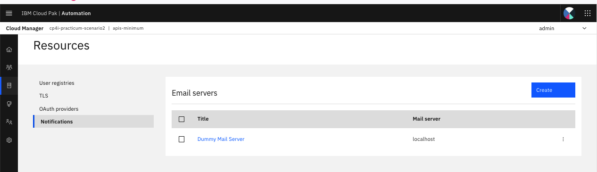

Details of a dummy mail server have been entered, edit this entry to include the the details of the mail server created on install. This can be found running mailhog.sh within install scripts.

Though this should be `mailhog.<NAME_SPACE>.svc.cluster.local`, and `port:1025`

Select default TLS client profile


Click test email to test the connection. Enter the recipient email id
and click Send Test Email.

The email should be sent successfully, if any errors ensure mail server is up, and details have been entered correctly.


Click Save to save the config.

You can view the contents of the email within the mailhog UI to confirm.


### Configure admin email id

In the Cloud Manager, Go to Logged in User Settings fron the downwards facing arrow in the top right and click My Account.


Update the email id for the current account. This is Important as otherwise  you will not be able to create a portal service later on. 

Select save.

### API Manager (API Management)

Open the Cloud pak For Integration side bar, and select `Design->API's`. Select the API Management instance to launch, again signing in with the Cloud Pak User Registry.

You should now see the below, if you do not - ensure steps above were followed correctly.

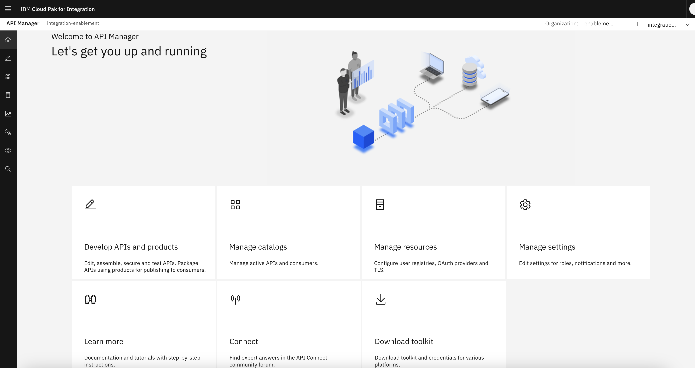

We are now at the home page of the API Manager. This is where we will Develop API's and Products, Manage Catalogs and User, Access Analytics etc.

#### Develop API

Our First task is to create an API to proxy our service created in App Connect earlier.

To do this, Click on Develop APIs and products. Create a new API. This will
encapsulate the API created on the ACE.

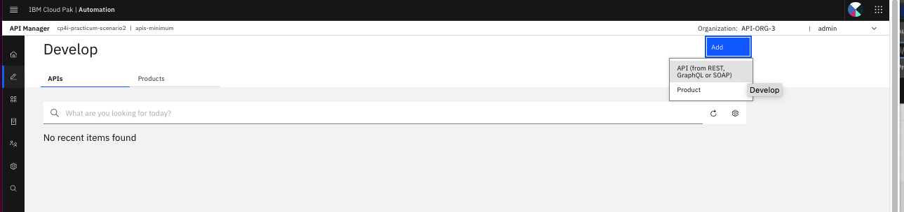

As we're providing an endpoint, and nothing else select `From target service`


Provide the details for Target service, note the title of the API becomes the default base path, and the name (which is noneditable), is shown for how we reference the API internally.

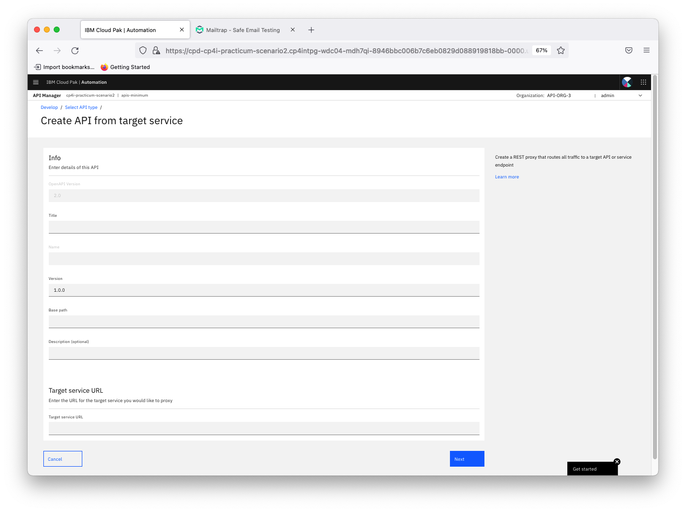

For the target service url, we will enter the url of endpoint in our intergration runtime created earlier

Enter the title of the API. This will also create an endpoint / base
path using which the API can be called and it will just redirect the
request to Target Service URL.


Click Next.


Click Edit API.


#### Configure API

After Clicking Edit API, API Design Screen will open.


As we are exposing only a POST service in the backend we can delete the
other operations from here. These are under `Paths-> / -> Operations`


Click Save.


Under Security Schema Click Add to add another security schema.


Select apiKey as the security definition key.

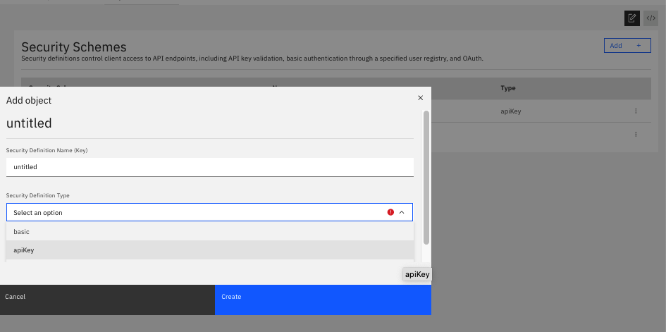

Enter the details as below.


Client Secret is added as security schema. Click Save.


Go to General -\> Security, Select the kebab to edit the schema.

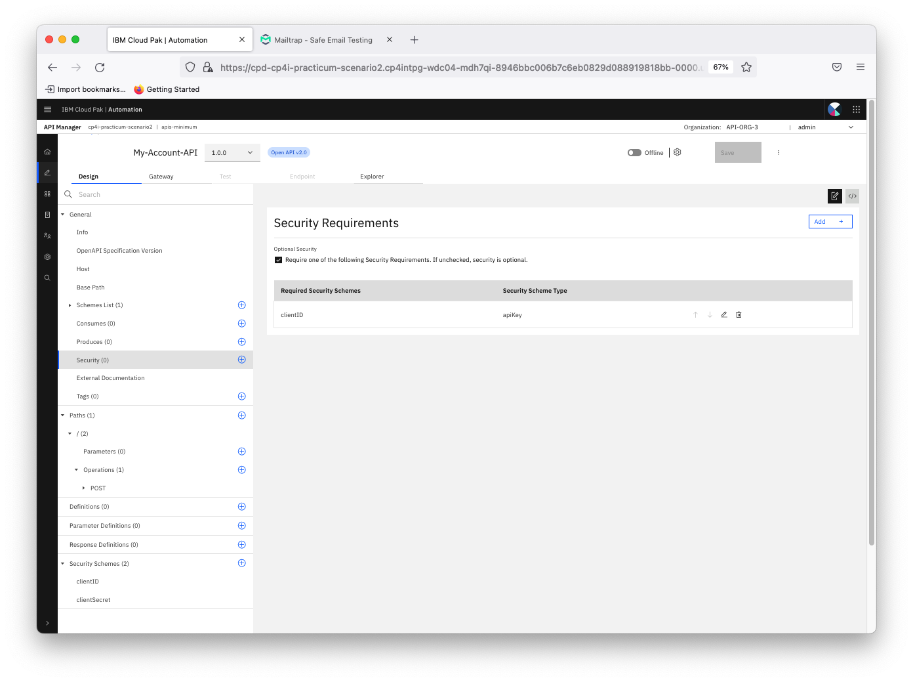

Select both clientId and clientSecret and Click Submit.


Click Save.

In the top bar, navigate to gateway and inspect the policy flow. This is where define the execution of the endpoint. We have various powerful nodes at our disposal to define the api operation.

This can allow us to: define multiple API operations seperated by Operation switches, invoke multiple endpint, rate limit invokations, log invokations, security mechanisms, transforms and importantly the ability to crete user defined policies and Gateway Scripts (note this is not available in SaaS basic )


Now make this API online, this will pubish the API to the Sandbox catalog- the base catalog of the API Manager and by default where all API's are published


### Develop API Product

Go to Home again and select develop API and Products.


Now we need to package this API into a product in order to publish it to a catalog. A product is an encapsulation of multiple API's and allows consumers to subscribe to the API's encolsed with certain rate limits.


Click Add -\> Product.


Click Next.


Give a product Name. Click Next.

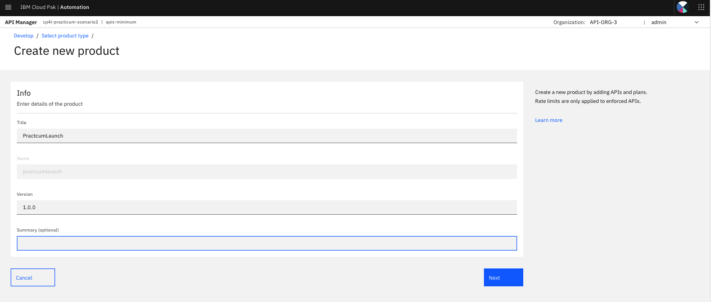

Select an API to be added into this product. Click Next.

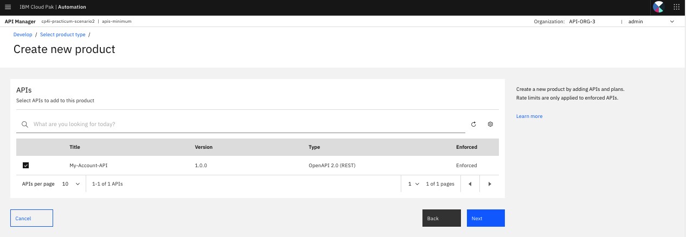

Review the plan details. You can more plans by clicking on Add Button.
Can define the new plan name and rate limit (eg. API Calls Frequency).


Click Next After adding the required plans.

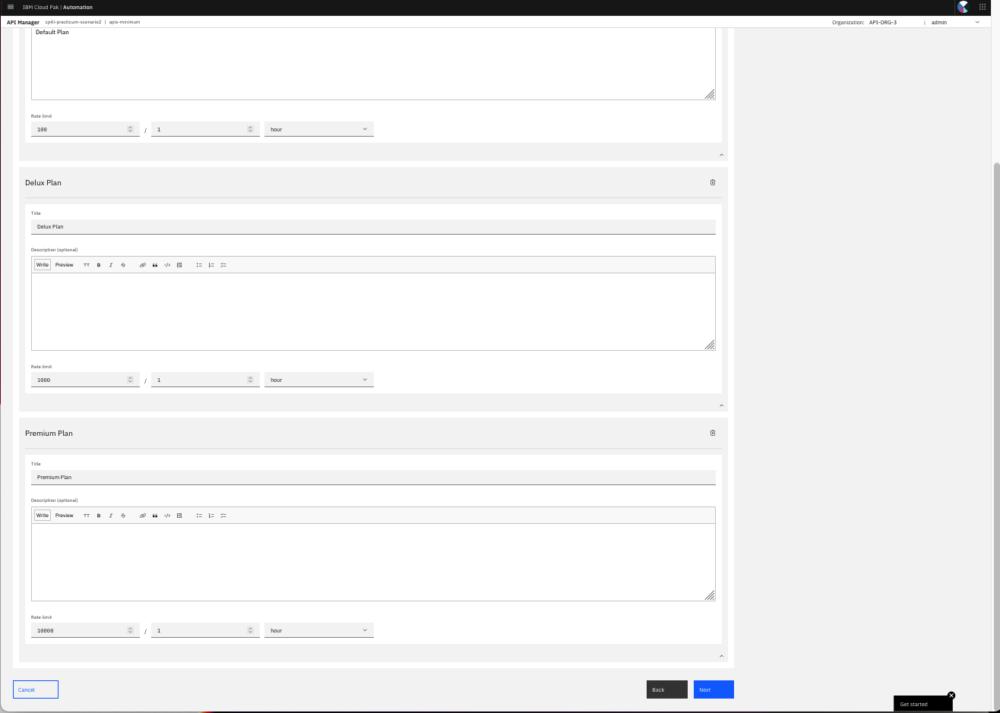

Click Next with default options. Note that this defines how users who login to the catalog can see the product. By default an API is public to the catalog i.e) Any user can view the product, endpoint, its opertions etc. but cannot subscribe without loggin in.


Click Done. We will publish it separately later after creating catalog.


New product is added with the new API.


Go to API Manager Manage Settings to update the email Notification
settings.

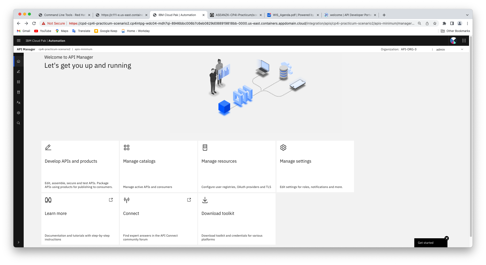

Go to Notifications.


Configure the sender name and email address.


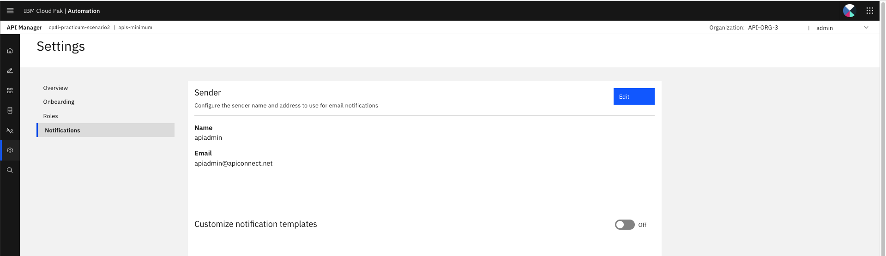

### Create Catalog

Now we can create a catalog. 

A Catalog is a staging target, and behaves as a logical partition of the gateway and the Developer Portal. The URL for API calls and the Developer Portal are specific to a particular Catalog. In a typical configuration, an API provider organization uses a development Catalog for testing APIs under development and a production Catalog for hosting APIs that are ready for full use. A common approach is to have a development cloud with a development Catalog, a few test Catalogs and a production cloud that might have its own test Catalog.

You can use a Space to partition a Catalog so multiple teams can manage Products and APIs independently in a single Catalog. A Space is conceptually like a sub-catalog, except that Products and APIs in all Spaces in a given Catalog are published to the same developer portal. 

Go to manage catalogs under API Manager.

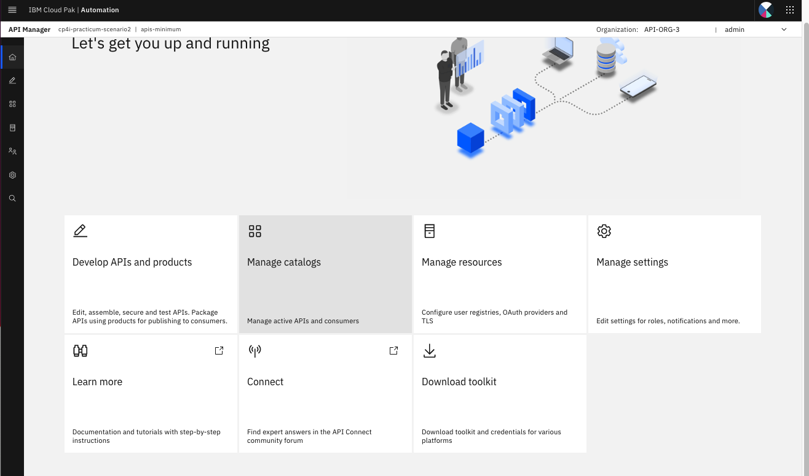

Create new Catalog.

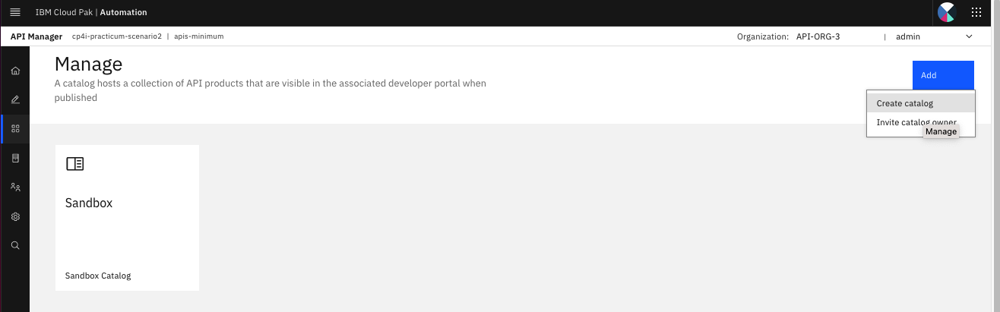

Enter a name and Click Create


Open the new Catalog and navigate to Catalog settings, here we have a selection of settings we can configure. Explore to get an idea of the controls wehave.

Finally, navigate to the `Portal` subheading. This is where we define a portal that will allow users to explore our API Catalogs. We have two options here:
 1. Consumer Catalog, a lightweight portal with basic functionality
 2. Portal, a complete content management system which is fully customiseable.


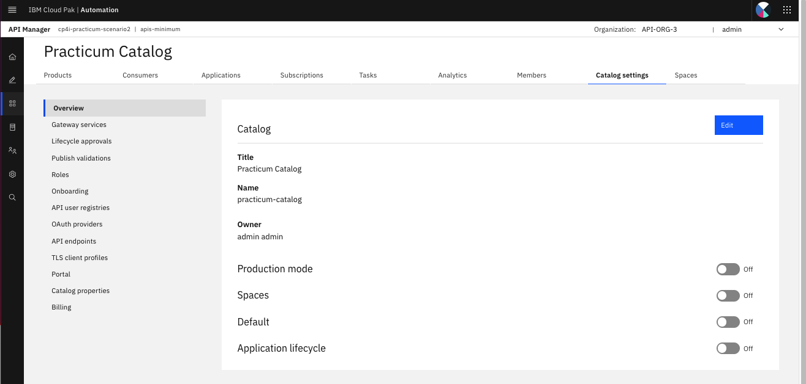

Create a developer portal here.

Click Create. If the email if is not updated for the logged in user
account, then there will be an error mentioning so. Update the admin
user email id from Cloud Manager -\> My Account as explained earlier.
Also make sure smtp settings are correct under Cloud Manager
notification settings.


It will take a few minutes for the portal service to be ready. You will
receive an email once its ready to set the password for the portal admin
account.

#### Publish Produc

Now that we have a portal, lets publish the product to the new catalog from API Manager first.
So it can be visible in this catalog.

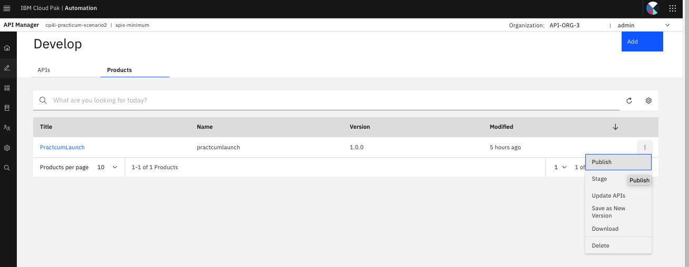

Select the new catalog. You can set the catalog visibility to
Authenticated users. Click Publish. It will be published shortly.


### API Connect Developer Portal

(optional) Once you receive the email to set the password click on that
link and set the password for the admin account for API Manager.

Note down the Portal API URL from **Catalog Settings -\> Portal** and
open it in Mozilla Browser. Eg.

**Note:** Use **Mozilla Browser** only for this as there will be issues
with chrome browser with default self-signed certificate settings and
chrome will prevent the connection.

You may also take a look at a sample API Connect customer with a public portal, [Axis Bank Portal](https://apiportal.axisbank.com/portal/).


Click on **Create Account** to create a new account.


You will receive email with activation instructions.

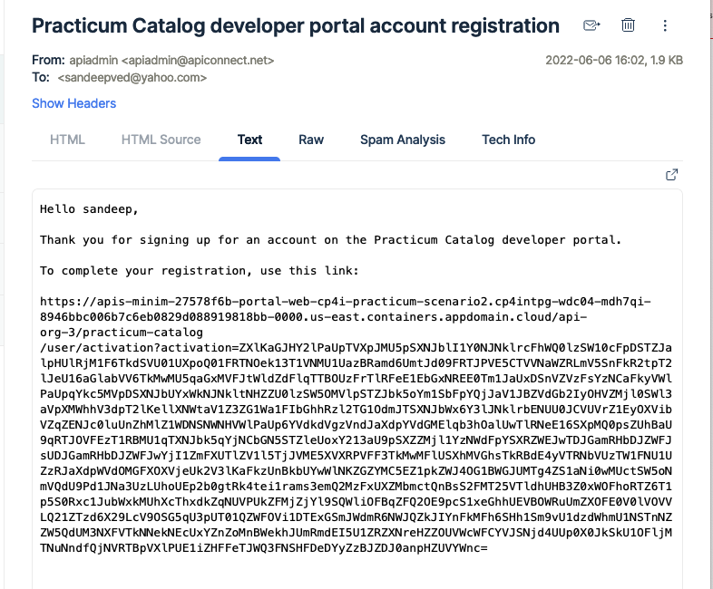

The account will be activated and you will be able to login with the
newid. Sign in with the new id and password.


Click on Create a new App.


Enter an application Name and click Save.


Once application created successfully, note down the Key and Secret for
this application. You can not see the Key and Secret for this
application after this page. Each application will interact with API
Manager/ACE using this client secret. Click OK.


-   Key: 81b789b18XXXXXXXXXX069ec1757beb9

-   Secret: 0a38029dXXXXXXXXXXa16f47aa943eb

You can optionally click on verify link to verify your secret against
this application’s key.

Click on **Why not browse the available APIs** to subscribe to API
Product for this App.


Click on the published API product.


Just click on the **Select** button for one of the plan exposed by the
product.


Select the **application** to be subscribed.


To confirm subscription, click Next.


Click Done.

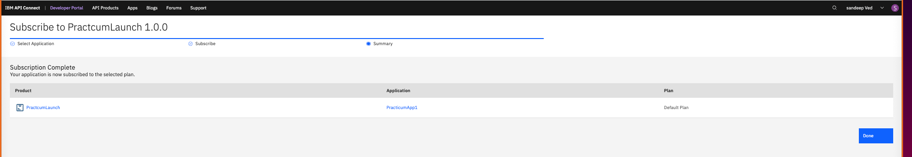

Click on **POST /** option under overview, in the left pane.


Click on **Try It** tab to test this API product.


Enter the API Secret for authentication and click Send.


If you receive an error like below, then it could be because you are
using any other browser than Firefox. Or the Certificate is not trusted.


Open this URL in the error below in the browser and accept the
certificate. Ignore the error.


Now You can try to send the API call one more time, you should be able
to see the response successfully.

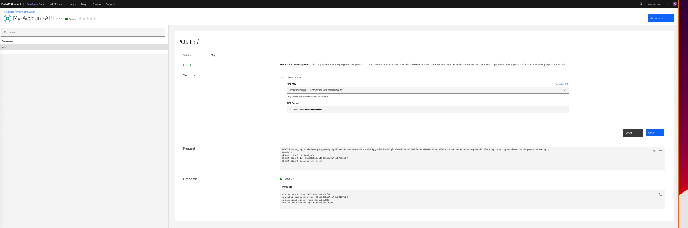

Check in the IBM MQ if this message has been stored in Queue
Successfully. Go to Integration Instances -\> Messaging instance Name
-\> Manage -\> Queue name


<span id="_Toc105518935" class="anchor"></span>**Event Streams**

Within the Cloud Pak for Integration dashboard, open the sidebar and Navigate to `Run -> Kafka Clusters`. From here, we can launch the Event Streams instance by selecting the Name of our instance, in this case `es-enablement`. 


Here we have the UI for all of our Kafka Components. Here we can Manage topics, view consumer groups, manage schemas, add connectors, and monitor our environments. 


For this task, we need to create two Kafka Topics:
1. `TRANSFER_REQUESTS`, a topic which will contain details of succesful bank transfers
2. `LARGE_TRANSFERS`, a topic which will be populated with suspicious transaction details later on.

We Will walk through the process of creating these Via the UI, but if you please you may also create these declaratively with Custom Resources in OpenShift. All objects in Event Streams can be created declaratively, including topics, users, connectors, geo-replication, etc.

Select `Topics -> Create Topic`, here we can define the configuration of our topics, including partition, retention policies and replicas.

Select `Show all available options` to view detailed configurations. Leave all values as default. Note as we only have 1 Zookeeper Broker, we can only configure 1 replica and partition. Follow these steps to create two topics with the names as above.


### Connect to Cluster
From this interface, we can access the details we need to connect to this environment. Select `Connect to This Cluster` from the topics page to view connection details. Note that as we have only configured an internal listener without  authentication, the options here are limited.

In an instance where we have authentication configured, we can generate TLS Client Credentials as well as SCRAM (User/Psssword) credentials. In the background this will create a kafka user and generate the credentials which we can then download from the UI to integrate with the our applications.


<span id="_Toc105518945" class="anchor"></span>**Event Processing**

Open the event processing interface and login with the supplied username and password.

We're going to create a flow, which can be tested iteratively at each node as you build out 
the flow so that you can observe the output of each node you configure BEFORE adding additional nodes.
If you develop this way, which is what is intended, then you will know the what the input of the node you
are adding next will be, which helps in debugging.

To do this, use the 'Run Flow' button at the top right of the canvas and select 'Include Historical' so that you 
rewind the offset of the topic back to the start of the event stream each time you test your work.


  
 Click the Create button on the splash page to create a new flow and give it a title.
  
 Select the event source node and configure it for the TRANSFER_REQUESTS topic in the 
 Event Streams cluster. This will involve a series of steps to provide connection details
 for Event Streams, (bootstrap address, accepting certificates, providing credentials).
 
  

    
  Select the topic, don't worry about keys and headers for this exercise (skip that screen) and 
  modify the event structure to set the amount to a double instead of string 
  as we're going to use field this in a calculation. Make sure you scroll down and select the 
  Event time source field for this node as the 'transfer_date' field instead of the 
  default 'event_time' field, as we want to use the transaction date and time for this flow and not the 
  time the message arrived on the topic. While these two timestamps might be close in production, we should use the 
  core banking system time and date as this will match the actual transaction time the customer and banking staff will see.
  Finally, click 'Configure'.
   
  Drag and drop an aggregate node on to the canvas, wire it to the previous Source node and then edit the node.
  
    
  Name the node, set the time window to 60 minutes (we're looking for transactions for the same account within a 60 minute window) 
  and set the aggregate function as shown below. Click 'Next'.
   
 
    
  Rename the Output property names as appropriate (SUM_transfer_amount isn't very meaningful).This screen also allows you
  to remove properties you do not wish to keep. Click 'Configure'.
  
  Drag a filter node on and wire it up. Configure it to pass aggregated transactions of an amount greater than 25000. Use the 
  assistant to help you with this.
    
  Finally drag an event destination node onto the canvas. You configure this in the same way as the source node, except
  the topic name will be a new topic you have created in Event streams for the alert messages.
  
  If you don't see any results after a minute or so when you test, stop and re-run the flow again.
  Also remember for testing purposes you need to 'close the time window' so that you don't have transactions for the same from_id
  in the same 60 minute time window as the end of the stream. This may prevent output of the results in your test environment.
  
  When everything is working as expected you will see aggregated results of any transactions using the same from_id value 
  within a time window of 60 minutes.


[Go to Configuration Index](#ibm-cloud-pak-for-integration---configuration)

[Go back to -> Table of Contents](../README.md)

[Go to next topic -> Conclusion](../Conclusion/README.md)
