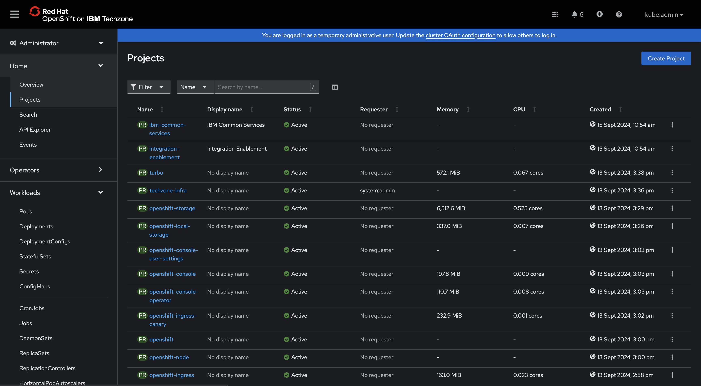
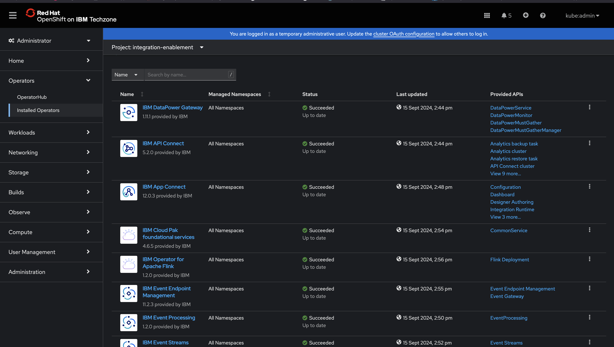

# Installation

### [Topic 5.1: Creating Projects](README.md#creating-projects)
### [Topic 5.2: Creating Catalogue Sources](README.md#creating-catalogue-sources)
### [Topic 5.3: Add Entitlement Keys](README.md#add-entitlement-keys)
### [Topic 5.4: Add Subscriptions](README.md#add-subscriptions)
### [Topic 5.5: Install Platform Navigator](README.md#install-platform-navigator)
### [Topic 5.6: Create Instances](README.md#create-instances)

## Creating Projects 

Projects in OpenShift are analogous to Kubernetes namespaces. We will create two projects with the following names:

1) integration-enablement
2) ibm-common-services

Execute the following script to create the resources above:

```commandline
./utils/projects.sh
```

Navigate to your OpenShift Console and confirm the projects listed above are visible:



Note: You can sort results in ascending/descending mode for a given column, for instance the date field.

integration-enablement will host all the services we will deploy in this exercise, whereas ibm-common-services will host
auxiliary services required for effective functioning of the components in a production setting, such as the identity 
management service.


## Creating Catalogue Sources

Each service is sourced from a given catalog source, which can be found [here](https://github.com/IBM/cloud-pak/tree/master/repo/case).
This repository contains CASE files for all operator powered IBM products. 

For the services provided in CP4I, the case files can be found here:

1) [Platform](https://raw.githubusercontent.com/IBM/cloud-pak/master/repo/case/ibm-integration-platform-navigator/7.3.4/OLM/catalog-sources.yaml)
2) [Assets](https://raw.githubusercontent.com/IBM/cloud-pak/master/repo/case/ibm-integration-asset-repository/1.7.3/OLM/catalog-sources-linux-amd64.yaml)
3) [APIC](https://raw.githubusercontent.com/IBM/cloud-pak/master/repo/case/ibm-apiconnect/5.2.0/OLM/catalog-sources.yaml)
4) [ACE](https://raw.githubusercontent.com/IBM/cloud-pak/master/repo/case/ibm-appconnect/12.0.3/OLM/catalog-sources.yaml)
5) [MQ](https://raw.githubusercontent.com/IBM/cloud-pak/master/repo/case/ibm-mq/3.2.4/OLM/catalog-sources.yaml)
6) [Event Streams](https://raw.githubusercontent.com/IBM/cloud-pak/master/repo/case/ibm-eventstreams/3.5.0/OLM/catalog-sources.yaml)
7) [Event Endpoint Management](https://raw.githubusercontent.com/IBM/cloud-pak/master/repo/case/ibm-eventendpointmanagement/11.2.3/OLM/catalog-sources.yaml)
8) [Datapower Gateway](https://raw.githubusercontent.com/IBM/cloud-pak/master/repo/case/ibm-datapower-operator/1.11.2/OLM/catalog-sources.yaml)
9) [Aspera](https://raw.githubusercontent.com/IBM/cloud-pak/master/repo/case/ibm-aspera-hsts-operator/1.5.13/OLM/catalog-sources.yaml)
10) [Redis](https://raw.githubusercontent.com/IBM/cloud-pak/master/repo/case/ibm-cloud-databases-redis/1.6.11/OLM/catalog-sources.yaml)
11) [Foundations](https://raw.githubusercontent.com/IBM/cloud-pak/master/repo/case/ibm-cp-common-services/4.6.5/OLM/catalog-sources.yaml)

Note Aspera depends on Redis, hence the Redis entry above.

A couple of scripts can be found in the utils directory. They aim to simplify the installation of all the assets above.

First, run the following command:

```commandline
./utils/ibm-pak.sh
```

This script downloads a local binary (ibm-pak) which can be regarded as the IBM case client, simplifying fetching of the
relevant resources from the case repository above.

Now, run the catalog-source script:

```commandline
./utils/cs.sh
```

This script will download the necessary sources, performs appropriate health checks and finally cleans up any transient
resources. A message is flushed at the completion of the script.

## Add Entitlement Keys

You will add the entitlement key you have been provided to the cluster as a pull secret to deploy Cloud Pak for 
Integration capabilities. To do so, follow the steps [here](https://www.ibm.com/docs/en/cloud-paks/cp-integration/16.1.0?topic=fayekoi-finding-applying-your-entitlement-key-by-using-ui-online-installation#obtaining-your-entitlement-key__title__1).

Once you get your hands on the entitlement key, execute the following script:

```commandline
./utils/secret.sh
```

In a nutshell, the secret titled "ibm-entitlement-key" is the image pull secret used to fetch all running IBM provided 
container housed in IBM's official image [registry](cp.icr.io)

## Add Subscriptions 

Adding subscriptions referencing the catalog-sources results in the fetching and deployment of operator container images  
as pods in the OpenShift cluster. In addition, CustomResourceDefinitions are made known to the cluster allowing CP4I
Integration Administrators and Developers alike to manage CP4I specific services, such as Queue Managers and API Management 
instances, as facilitated by the aforementioned operators.

The subscriptions can be created programmatically, similar to the catalog sources in the previous section.
That said, they can also be created via the UI, as is covered in this section. For sake of completeness, the relevant
scripts can be found at the following locations below:

```commandline
utils/sub.sh
utils/prerequisite-subscriptions.json
utils/subscriptions.json
```

It is highly recommended you proceed with this installation in the manner prescribed below. That is, via 
the UI, as opposed to the scripts provided above. It better helps piece all the components together.

For reference, the complete set of instructions can be found [here](https://www.ibm.com/docs/en/cloud-paks/cp-integration/16.1.0?topic=io-installing-operators-by-using-red-hat-openshift-console). 
This section effectively summarises said instructions.

Follow the steps provided [here](https://www.ibm.com/docs/en/cloud-paks/cp-integration/16.1.0?topic=io-installing-operators-by-using-red-hat-openshift-console#installing-operators__title__1).
Initially, search for "CP4I" in the provided textbox and click on the "Cloud Pak for Integration" tile. 

Leave the default configurations as they are and click on the install button provided. That is:

1) The Installation Mode: All Namespaces in the cluster
2) Update Approval: Automatic
3) Update Channel and version should be left to their default values
4) Installed namespaces should be left to the default value (typically openshift-operators with the exception of cert-manager)


The image below shows the default configurations for MQ. Note the channel name and version will differ depending upon 
the product/service chosen:


Now, rinse and repeat the procedure given above by searching for the following services in the textbox within the 
OperatorHub:

1) API Connect
2) IBM MQ
3) IBM Event Streams
4) IBM Event Processing
5) App Connect
6) IBM Cloud Pak Foundational Services
7) Event Endpoint Management
8) IBM Operator for Apache Flink
9) Cert-Manager Operator for Red Hat OpenShift

Note, there exists additional Subscriptions beyond this, such as Aspera and the IBM Licensing Operator, but they won't 
be used in this exercise. As such, they are omitted.

Services which contain subsystems such as API Connect use Cert Manager to manage (m)TLS certificates
used to secure communications between said subsystems.

Once complete, wait a few minutes or so and check the "Installed Operators" within the "Integration Enablement" project as shown
below. All components should report "Succeeded" as given in the Status Column.



## Install Platform Navigator

The Platform Navigator (UI) provides an administrative interface across all CP4i capabilities. 
The navigator has a dependency on the Cloud Pak Foundational services installed in the previous section.

This component is typically deployed before all other components. Let us go ahead and deploy said component.
Run the following script:

```commandline
./utils/deploy-platform-navigator.sh
```

Deploying this component also deploys an instance of KeyCloak. CP4I delegates identity and user management to Keycloak, 
which Keycloak can then delegate to other services such as Okta and Entra ID.

Feel free to run this command and wait for the service to be ready:

```commandline
oc get PlatformNavigator -n integration-enablement -w
```

Note, do not be put off by transient errors that may happen during deployment. This is normal. It takes around 20 minutes
to complete. Feel free to grab a coffee in the interim.

Ultimately, it should register a status of "Ready", as seen below:


Before deploying the other components, a new user in Keycloak ought to be registered, and authorised to interact
with the services deployed in the following sections.

Run the following script:

```commandline
./utils/display-kc-details.sh
```
Feel free to inspect the contents of the script. As stated earlier, the ibm-common-services houses auxiliary services
employed by the Cloud Pak, such as the identity management solution, Keycloak.

Login to the endpoint using the credentials outputted by the script.

Once logged in successfully, ensure you are in the Cloudpak realm as shown in the image below:


Click on the users tab and add a new user as shown below:


Ensure "Update Password" is selected for the required user action as shown below. You need not join a group as we are 
dealing with one user per cluster in this exercise.


Head over to the credentials tab and "Set Password" as shown below:


You may wish to set the temporary flag to false for this exercise. It goes without saying, this ought to be set to True
in a production setting. In either case, the password has a minimum length constraint of 15 characters.

Finally, navigate to the "Role Mapping" tab as shown below:


Click on "Assign Role", in the "pop up", ensure you "filter by client" and search for "admin" in the provided textbox.
Select the admin role and assign the role as shown below:


Do note in a production setting you likely would have different users/groups assigned to specific capabilities. For 
instance, an MQ group, an Event Streams group and an ACE group. There exists specific granular roles for each 
capability, such as "dashboard-admin" and "eventstreams-admin" as seen in the image above.

We can now access the deployed Platform Navigator! Run the following script to display the URL:

```commandline
./utils/display-pn-details.sh
```

Login using the username you created in Keycloak. You should be presented with the following view now:


In the next section, we will deploy and configure each component on a per service basis. We shall do it programmatically
(ie, by way of scripts). Do note this can be done via the UI as well.

[Go back to -> Table of Contents](../README.md)

[Go to next topic -> Configuration](../Configuration/README.md)
