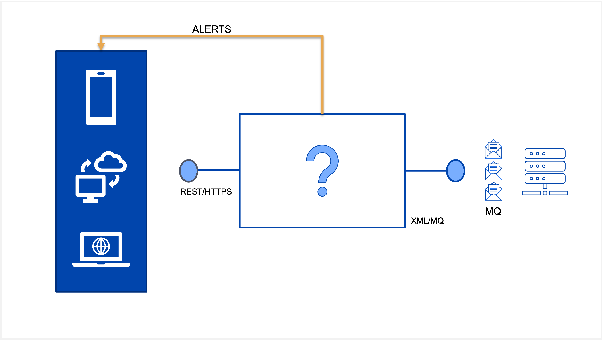

# Scenario Details

### [Topic 1.1: Introduction](README.md#introduction)
### [Topic 1.2: Requirement](README.md#requirement)
### [Topic 1.3: Challenge and Approach](README.md#challenge-and-approach)

## Introduction

- The XYZ Bank still has a core banking system running on IBM System Z. Currently the only way to integrate with this system is via MQ.

- The core banking system provides typical account functions such as query balance, deposit and withdraw. 

- The Bank has initiated a digital transformation program to modernize their channel applications such as Internet  Banking, using reactive technology to make it more user friendly and compelling to their customers.

- They want to user APIs in order to  quickly unlock their assets in the legacy systems - so that their channel applications can consume.

- Security is paramount, they need to ensure that the APIs exposed needs to be secured using client id/secret and OAuth/OIDC.

## Requirement

- Architect and build a solution that enable the customer to expose their digital assets via APIs using Cloud Pak for Integration.

- Each transaction should trigger events that can be audited or based on business rules trigger alerts.

## Challenge and Approach

Your team has five days to document your approach to a Solution to the customers business problem using CP4I 
capabilities and any external capabilities that you think are necessary or useful.

Do note we will be providing an overview of the basics of each component and walking you through a typical 
end to end scenario. When and where necessary, students will be prompted to "fill in the blanks" to put their newly 
found skills to the test!

**Day 5**: Demonstrate your solution to whole class. If time permits, tutors will add additional requirements where
necessary.

[Go back to -> Table of Contents](../README.md)

[Go to next topic -> Introduction](../Introduction/README.md)